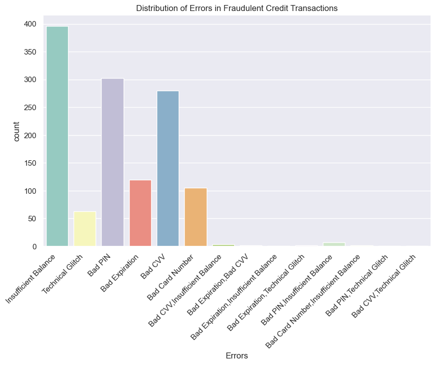
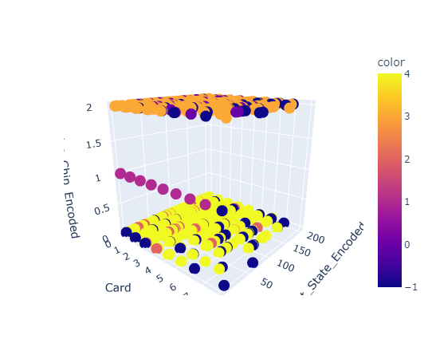

# Card Fraud Detection 

## Introduction

Card fraud is a major issue for financial institutions and consumers alike, causing billions of dollars in losses every year. Traditional methods for detecting fraud, such as rule-based systems and supervised learning, have limitations when applied to imbalanced datasets, where the number of fraudulent transactions is much smaller than the number of legitimate transactions. In this project, we propose to explore the use of unsupervised learning techniques for card fraud detection in imbalanced datasets. By leveraging the inherent patterns and anomalies in the data, unsupervised methods can effectively identify fraudulent transactions without the need for labeled data or prior knowledge of the distribution of fraud. Through a combination of clustering, dimensionality reduction, and anomaly detection techniques, we aim to develop a robust and effective card fraud detection system that can be applied in real-world scenarios.

## Dependencies

The following Python libraries are required to run the code:

    pandas
    numpy
    matplotlib
    seaborn
    sklearn
    plotly

## EDA

## Modelling

### Clustering Techniques

Kmeans Clustering

    K-means clustering is an unsupervised machine learning algorithm used to identify and group similar data points together. In this project, we apply Kmeans clustering to group similar transactions together and identify the fraudulent transactions.
    
DBSCAN Clustering

    Density-based spatial clustering of applications with noise (DBSCAN) is another unsupervised machine learning algorithm used for clustering. Unlike Kmeans, it can identify clusters of arbitrary shape and handle noise (outliers). In this project, we apply DBSCAN clustering to identify clusters of fraudulent transactions.

<a href="https://www.flaticon.com/free-icons/credit-card" title="credit-card icons">Credit-card icons created by monkik - Flaticon</a>
 
